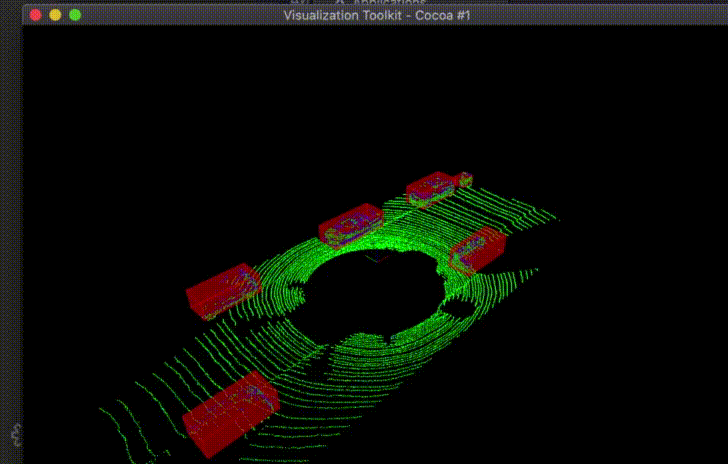

# Lidar Obstacle Detection

This project uses 3D RANSAC algorithm for segmentation between road surface and obstacles, given pre-recorded point cloud dataset loaded with PCL (Point Cloud Library). It then utilizes KD-Tree based clustering algorithm to cluster obstacles and uses bounding boxes to mark every cluster.

## Implementation

### RANSAC

RANSAC stands for Random Sample Consensus, and is a method for detecting outliers in data. RANSAC runs for a max number of iterations, and returns the model with the best fit. Each iteration randomly picks a subsample of the data and fits a model through it, such as a line or a plane. Then the iteration with the highest number of inliers or the lowest noise is used as the best model.

[ransac.h](./src/ransac.h)

### KD Tree

A KD-Tree is a binary tree that splits points between alternating axes. By separating space by splitting regions, nearest neighbor search can be made much faster when using an algorithm like euclidean clustering.

[kdtree.h](./src/kdtree.h)

### Clustering

A euclidean clustering technique is used by searching all points within the proximity of a given point. The idea is to iterate through each point in the point cloud and keep track of which points have been processed already. For each point add it to a list of points defined as a cluster, then get a list of all the points in close proximity to that point.

```python
# Pseudo code
Proximity(point,cluster):
    mark point as processed
    add point to cluster
    nearby points = tree(point)
    Iterate through each nearby point
        If point has not been processed
            Proximity(cluster)

EuclideanCluster():
    list of clusters 
    Iterate through each point
        If point has not been processed
            Create cluster
            Proximity(point, cluster)
            cluster add clusters
    return clusters
```

[cluster.cpp](./src/cluster.cpp)

## Result



## Installation

### Linux Ubuntu 16

Install PCL, C++

The link here is very helpful, 
https://larrylisky.com/2014/03/03/installing-pcl-on-ubuntu/

A few updates to the instructions above were needed.

* libvtk needed to be updated to libvtk6-dev instead of (libvtk5-dev). The linker was having trouble locating libvtk5-dev while building, but this might not be a problem for everyone.

* BUILD_visualization needed to be manually turned on, this link shows you how to do that,
http://www.pointclouds.org/documentation/tutorials/building_pcl.php

